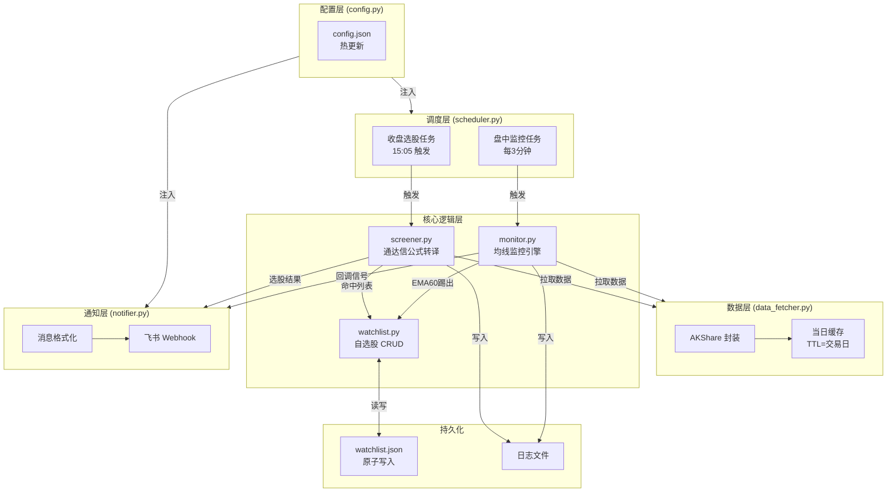
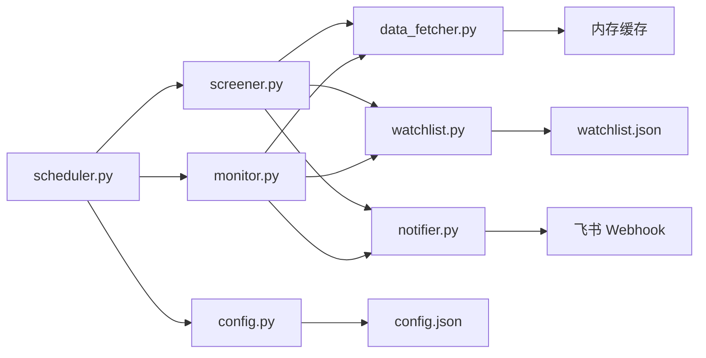
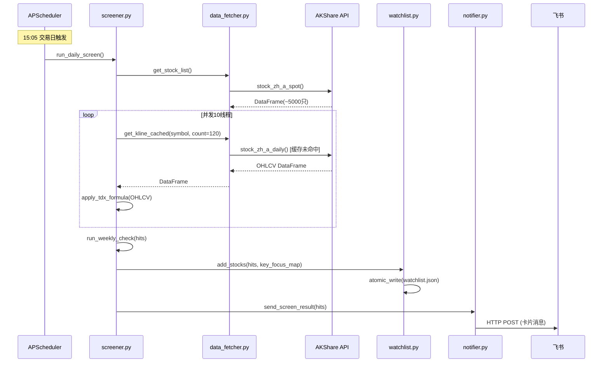

# Design Document: A股量化选股监控系统

## Overview

本系统是一个全自动的 A 股量化选股、监控与飞书通知系统。系统基于通达信选股公式（转译为 Python/MyTT），每个交易日收盘后扫描全 A 股（约 5000 只），筛选符合条件的股票加入自选股列表；盘中对自选股持续监控均线突破回调信号；通过飞书 Webhook 推送通知。

**核心流程：**
1. 每日 15:05 触发收盘选股 → 全 A 扫描 → 命中股票加入自选股 → 飞书推送选股结果
2. 盘中每 3 分钟 → 对自选股检测多头排列 + 均线触碰 → 产生回调信号 → 飞书推送
3. 收盘检测 EMA60 踢出规则 → 跌破 EMA60 的自选股自动移除

**技术栈：** Python 3.11，AKShare（数据源），MyTT（指标库），APScheduler（调度），飞书 Webhook（通知），JSON 文件（持久化），asyncio + ThreadPoolExecutor（并发）

---

## Architecture

### 系统架构图



### 模块关系图



### 数据流图



---

## Components and Interfaces

### 1. `config.py` — 配置管理

```python
DEFAULT_CONFIG = {
    "feishu_webhooks": [],          # 支持多个 URL
    "scan_interval_minutes": 3,
    "close_screen_time": "15:05",
    "ema_touch_threshold": 0.02,    # 2%
    "max_concurrent_fetches": 10,
    "kline_count": 120,
    "log_file": "logs/screener.log"
}

def load_config() -> dict: ...
def save_config(cfg: dict) -> None: ...
def reload_config() -> dict: ...   # 热更新，不重启进程
```

### 2. `data_fetcher.py` — AKShare 封装 + 缓存

```python
def get_stock_list() -> pd.DataFrame:
    """返回全 A 股列表，columns=['code', 'name']"""

def get_daily_kline(symbol: str, count: int = 120) -> pd.DataFrame:
    """获取日线 K 线，columns=['open','high','low','close','volume']，dtype=float64
    失败时重试 3 次，间隔 1 秒"""

def get_weekly_kline(symbol: str, count: int = 120) -> pd.DataFrame:
    """获取周线 K 线，同上格式"""

def get_kline_cached(symbol: str, count: int = 120, freq: str = "daily") -> pd.DataFrame:
    """带当日缓存的 K 线获取"""

def batch_fetch_klines(
    symbols: list[str],
    count: int = 120,
    freq: str = "daily",
    max_workers: int = 10
) -> dict[str, pd.DataFrame]:
    """并发批量拉取，返回 {symbol: DataFrame}"""

def clear_daily_cache() -> None:
    """清除当日缓存（每日收盘后调用）"""
```

**缓存策略：**
- 缓存 key：`f"{symbol}_{freq}_{today}"`
- 缓存存储：内存字典 `_cache: dict[str, CacheEntry]`
- 有效期：当个交易日（`date == today`）
- 并发安全：`threading.Lock` 保护写操作

### 3. `screener.py` — 通达信公式转译

```python
def compute_indicators(df: pd.DataFrame) -> dict:
    """计算所有中间指标，返回指标字典
    输入: OHLCV DataFrame (至少120行)
    输出: {
        'BUYIN': np.ndarray, 'SALE': np.ndarray,
        'K': np.ndarray, 'D': np.ndarray, 'J': np.ndarray,      # 5周期KDJ
        'K2': np.ndarray, 'D2': np.ndarray, 'J2': np.ndarray,   # 8周期KDJ
        'K24': np.ndarray, 'D24': np.ndarray, 'J24': np.ndarray, # 55周期KDJ
        'YALI': np.ndarray, 'YALI2': np.ndarray,
        'ZT': np.ndarray, 'CT': np.ndarray
    }
    """

def apply_selection_formula(df: pd.DataFrame) -> bool:
    """对单只股票执行选股公式，返回是否命中
    除零时返回 False 并记录警告"""

def run_daily_screen(
    stock_pool: list[str] | None = None,
    count: int = 120
) -> list[ScreenResult]:
    """全 A 股日线选股扫描
    Returns: [ScreenResult(code, name, change_pct, key_focus)]"""

def run_weekly_check(
    codes: list[str],
    count: int = 120
) -> set[str]:
    """对日线命中股票执行周线复核，返回同时满足周线条件的股票代码集合"""
```

**ScreenResult 数据类：**
```python
@dataclass
class ScreenResult:
    code: str
    name: str
    change_pct: float   # 当日涨跌幅 %
    key_focus: bool     # 是否日线+周线共振
```

### 4. `watchlist.py` — 自选股 CRUD

```python
@dataclass
class WatchlistEntry:
    code: str
    name: str
    added_at: str       # ISO 8601 datetime string
    key_focus: bool
    removed_at: str | None = None
    remove_reason: str | None = None

def load_watchlist() -> list[WatchlistEntry]: ...
def save_watchlist(entries: list[WatchlistEntry]) -> None:
    """原子写入：先写 watchlist.json.tmp，再 os.replace()"""

def add_stocks(results: list[ScreenResult]) -> None:
    """批量添加，已存在则更新 key_focus，不重复添加"""

def remove_stock(code: str, reason: str = "") -> bool:
    """按代码移除，返回是否成功"""

def remove_below_ema60(klines: dict[str, pd.DataFrame]) -> list[str]:
    """检查所有自选股，移除收盘价跌破 EMA60 的股票，返回被移除的代码列表"""

def get_active_codes() -> list[str]:
    """返回当前有效自选股代码列表（用于监控）"""
```

### 5. `monitor.py` — 均线监控引擎

```python
@dataclass
class PullbackSignal:
    code: str
    name: str
    ema_name: str       # "EMA5" | "EMA10" | "EMA15"
    current_price: float
    ema_value: float
    change_pct: float
    triggered_at: str   # datetime string

def check_bull_alignment(ema5: float, ema10: float, ema15: float, ema30: float) -> bool:
    """判断多头排列：EMA5 >= EMA10 >= EMA15 >= EMA30"""

def check_ema_touch(price: float, ema: float, threshold: float = 0.02) -> bool:
    """判断价格是否在 EMA 的 threshold 范围内"""

def run_monitor_scan(threshold: float = 0.02) -> list[PullbackSignal]:
    """对所有自选股执行一次监控扫描，返回新产生的回调信号（去重）"""

def _is_duplicate_signal(code: str, ema_name: str, today: str) -> bool:
    """检查同一交易日内是否已发送过该信号"""

def _mark_signal_sent(code: str, ema_name: str, today: str) -> None:
    """记录已发送信号，防止重复"""
```

**去重机制：** 内存字典 `_sent_signals: set[str]`，key 格式 `f"{today}_{code}_{ema_name}"`，每日开盘时清空。

### 6. `notifier.py` — 飞书通知

```python
def format_screen_message(results: list[ScreenResult], date: str) -> dict:
    """格式化选股结果为飞书卡片消息 payload"""

def format_pullback_message(signals: list[PullbackSignal]) -> dict:
    """格式化回调信号为飞书卡片消息 payload"""

def send_feishu(webhook_url: str, payload: dict, timeout: int = 10) -> bool:
    """发送飞书消息，失败重试一次，返回是否成功"""

def send_to_all(payload: dict, webhooks: list[str]) -> None:
    """向所有配置的 Webhook URL 发送相同消息"""

def notify_screen_result(results: list[ScreenResult]) -> None:
    """选股结果通知入口（results 为空时不发送）"""

def notify_pullback_signals(signals: list[PullbackSignal]) -> None:
    """回调信号通知入口"""
```

**飞书卡片消息格式：**
```json
{
  "msg_type": "interactive",
  "card": {
    "header": {
      "title": {"tag": "plain_text", "content": "📊 A股选股结果 - 2025-01-15（共3只）"},
      "template": "blue"
    },
    "elements": [
      {
        "tag": "markdown",
        "content": "**000001** 平安银行 涨跌幅:+7.8%\n**600519** 贵州茅台 涨跌幅:+8.2% ⭐ 重点关注"
      }
    ]
  }
}
```

### 7. `scheduler.py` — 任务编排

```python
def is_trading_day(dt: datetime) -> bool:
    """判断是否为交易日（排除周末和法定节假日）"""

def is_trading_time(dt: datetime) -> bool:
    """判断是否在盘中交易时间 09:30-11:30 或 13:00-15:00"""

def is_close_screen_window(dt: datetime, trigger_time: str = "15:05") -> bool:
    """判断是否在收盘选股窗口（trigger_time 到 trigger_time+25分钟）"""

def daily_screen_job() -> None:
    """收盘选股任务：选股 → 周线复核 → 更新自选股 → 发送通知"""

def monitor_job() -> None:
    """盘中监控任务：检测均线触碰 → 发送回调信号"""

def start_scheduler(config: dict) -> BackgroundScheduler:
    """启动 APScheduler，注册所有定时任务"""
```

---

## Data Models

### `watchlist.json` 结构

```json
[
  {
    "code": "000001",
    "name": "平安银行",
    "added_at": "2025-01-15T15:10:23",
    "key_focus": false,
    "removed_at": null,
    "remove_reason": null
  },
  {
    "code": "600519",
    "name": "贵州茅台",
    "added_at": "2025-01-14T15:08:11",
    "key_focus": true,
    "removed_at": null,
    "remove_reason": null
  }
]
```

### `config.json` 结构

```json
{
  "feishu_webhooks": ["https://open.feishu.cn/open-apis/bot/v2/hook/xxx"],
  "scan_interval_minutes": 3,
  "close_screen_time": "15:05",
  "ema_touch_threshold": 0.02,
  "max_concurrent_fetches": 10,
  "kline_count": 120,
  "log_file": "logs/screener.log"
}
```

### 内存缓存结构

```python
@dataclass
class CacheEntry:
    df: pd.DataFrame
    date: str           # "2025-01-15"
    freq: str           # "daily" | "weekly"
```

### 信号去重结构

```python
# 内存集合，每日开盘清空
_sent_signals: set[str] = set()
# key 格式: "{YYYY-MM-DD}_{code}_{ema_name}"
# 例: "2025-01-15_000001_EMA5"
```

---

## Correctness Properties

*A property is a characteristic or behavior that should hold true across all valid executions of a system — essentially, a formal statement about what the system should do. Properties serve as the bridge between human-readable specifications and machine-verifiable correctness guarantees.*

### Property 1: KDJ SMA 递推一致性

*For any* OHLCV 序列（长度 >= 120），screener 计算的 K、D、J 值 SHALL 与通达信 SMA 递推公式 `SMA(X,N,M)[i] = (M*X[i] + (N-M)*SMA[i-1]) / N` 逐元素一致（误差 < 1e-6）。

**Validates: Requirements 1.2, 1.6**

---

### Property 2: 选股公式完整性

*For any* OHLCV 序列，`apply_selection_formula()` 返回 `True` 当且仅当同时满足以下所有条件：
- `CLOSE[-1] >= YALI[-1]` 或 `CLOSE[-1] >= YALI2[-1]`
- `CLOSE[-1] >= EMA(CLOSE, 15)[-1]`
- `EMA5[-1] >= EMA10[-1] >= EMA15[-1]`（多头排列）
- `EXIST(CT, 1) == True`（当日涨幅 >= 7.5%）
- `EXIST(ZT, 1) == True`（当日涨幅 >= 9.5%）

**Validates: Requirements 1.3**

---

### Property 3: 自选股添加幂等性

*For any* 股票代码，将其添加到自选股列表两次，结果中该代码 SHALL 只出现一次（不重复添加）。

**Validates: Requirements 3.3**

---

### Property 4: 自选股 JSON 序列化 Round-Trip

*For any* 有效的自选股列表（`list[WatchlistEntry]`），序列化为 JSON 后再反序列化，SHALL 产生与原始列表字段值完全等价的结果。

**Validates: Requirements 3.2, 9.1, 9.2**

---

### Property 5: 多头排列 + 均线触碰信号生成

*For any* 自选股，当其 EMA5 >= EMA10 >= EMA15 >= EMA30（多头排列成立），且当前收盘价与 EMA5、EMA10 或 EMA15 中任意一条的偏差 <= 2%，`run_monitor_scan()` SHALL 为该股票产生至少一条 PullbackSignal。

**Validates: Requirements 5.3, 5.4**

---

### Property 6: 回调信号同日去重

*For any* 股票代码和均线名称组合，在同一交易日内多次调用 `run_monitor_scan()`，该组合 SHALL 最多产生一条 PullbackSignal（幂等性）。

**Validates: Requirements 5.5**

---

### Property 7: EMA60 踢出规则

*For any* 自选股，当其收盘价 < EMA60，调用 `remove_below_ema60()` 后，该股票 SHALL 不再出现在 `get_active_codes()` 返回的列表中。

**Validates: Requirements 5.7**

---

### Property 8: 飞书消息格式完整性

*For any* 非空的 `list[ScreenResult]`，`format_screen_message()` 生成的 payload SHALL 包含：消息标题（含日期和数量）、每只股票的代码和名称、涨跌幅；且 `key_focus=True` 的股票 SHALL 附加"⭐ 重点关注"标识。

**Validates: Requirements 4.5, 6.2**

---

### Property 9: 多 Webhook 全量发送

*For any* 包含 N 个 URL 的 Webhook 列表（N >= 1），`send_to_all()` SHALL 向每个 URL 各发送一次 HTTP POST 请求，共发送 N 次。

**Validates: Requirements 7.4**

---

### Property 10: 缓存命中不重复请求

*For any* 股票代码，在同一交易日内第二次调用 `get_kline_cached()` SHALL 直接返回缓存数据，不发起 AKShare 网络请求（AKShare 调用次数 = 1）。

**Validates: Requirements 8.2, 8.3**

---

### Property 11: AKShare DataFrame 解析 Schema

*For any* AKShare 返回的日线 DataFrame，`parse_kline_df()` 解析后的结果 SHALL 包含 `open`、`high`、`low`、`close`、`volume` 五列，且所有列的 dtype 均为 `float64`。

**Validates: Requirements 9.3**

---

### Property 12: 重试次数上限

*For any* 导致 AKShare 请求失败的股票，`get_daily_kline()` SHALL 最多重试 3 次后放弃，总调用次数 = 4（1次初始 + 3次重试）。

**Validates: Requirements 2.4**

---

## Error Handling

| 错误场景 | 处理策略 | 日志级别 |
|----------|----------|----------|
| AKShare 请求失败 | 重试 3 次（间隔 1s），耗尽后跳过该股票 | WARNING |
| HHV == LLV（除零） | 跳过该股票，不中断扫描 | WARNING |
| K 线数据 < 60 行 | 跳过该股票 | WARNING |
| K 线数据含 NaN | 跳过该股票 | WARNING |
| 周线数据 < 60 行 | 跳过周线检查，key_focus 保持 false | INFO |
| 飞书 Webhook 返回非 200 | 重试一次，失败后记录错误，不抛出异常 | ERROR |
| 飞书 Webhook URL 为空 | 跳过发送，记录警告 | WARNING |
| config.json 不存在 | 使用默认配置并创建文件 | INFO |
| watchlist.json 损坏 | 返回空列表，记录错误 | ERROR |
| 非交易日触发扫描 | 静默跳过 | DEBUG |
| 自选股列表为空 | 跳过监控，记录日志 | INFO |

**原子写入实现：**
```python
def save_watchlist(entries: list[WatchlistEntry]) -> None:
    tmp_path = WATCHLIST_FILE.with_suffix(".json.tmp")
    tmp_path.write_text(
        json.dumps([asdict(e) for e in entries], ensure_ascii=False, indent=2),
        encoding="utf-8"
    )
    os.replace(tmp_path, WATCHLIST_FILE)  # 原子操作
```

---

## Testing Strategy

### 单元测试（pytest）

针对纯函数和核心逻辑：

- `test_screener.py`：KDJ 计算、选股公式、除零处理
- `test_watchlist.py`：CRUD 操作、原子写入、EMA60 踢出
- `test_monitor.py`：多头排列判断、均线触碰、信号去重
- `test_notifier.py`：消息格式化、空列表不发送、Webhook URL 为空
- `test_config.py`：默认配置创建、热更新
- `test_data_fetcher.py`：缓存命中、NaN 处理、数据 Schema

### 属性测试（Hypothesis）

本功能涉及大量纯函数（KDJ 计算、选股公式、序列化、信号生成），适合使用属性测试验证普遍性质。

**使用库：** `hypothesis`（Python 属性测试标准库）

**最小迭代次数：** 每个属性测试 100 次（`@settings(max_examples=100)`）

**标注格式：** 每个属性测试用注释标注对应设计属性：
```python
# Feature: a-stock-quant-screener, Property 1: KDJ SMA 递推一致性
@settings(max_examples=100)
@given(ohlcv=st.builds(...))
def test_kdj_sma_consistency(ohlcv): ...
```

**属性测试覆盖：**

| 测试文件 | 对应属性 | 测试策略 |
|----------|----------|----------|
| `test_screener_props.py` | Property 1, 2 | 生成随机 OHLCV 序列，验证 KDJ 递推和选股公式 |
| `test_watchlist_props.py` | Property 3, 4 | 生成随机股票代码列表，验证幂等性和 round-trip |
| `test_monitor_props.py` | Property 5, 6, 7 | 生成随机均线值，验证信号生成和去重 |
| `test_notifier_props.py` | Property 8, 9 | 生成随机 ScreenResult 列表，验证消息格式 |
| `test_fetcher_props.py` | Property 10, 11, 12 | Mock AKShare，验证缓存和 Schema |

### 集成测试

- 端到端流程测试（Mock AKShare）：选股 → 自选股更新 → 飞书通知
- 调度器时间窗口测试：验证交易日/非交易日触发逻辑
- 并发安全测试：多线程同时写入 watchlist.json

### 性能基准

- 全 A 股扫描（5000 只，Mock 数据）：目标 < 30 分钟
- 自选股读取（1000 条）：目标 < 100ms
- 单只股票指标计算（120 根 K 线）：目标 < 10ms
